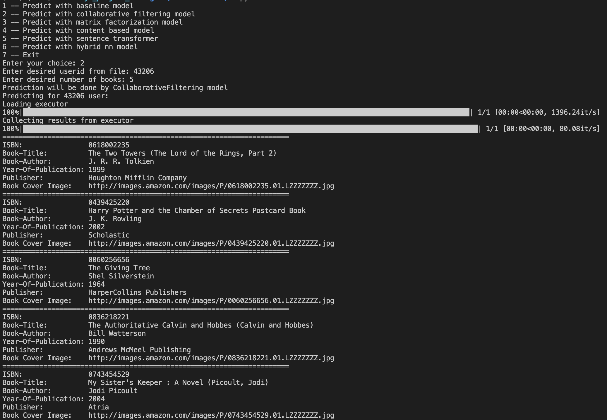

## :blue_book: :book: :orange_book: :neckbeard: Books recommendation project :neckbeard: :orange_book: :book: :blue_book:

**Project description:**
Recommendation system for books. 

**Project install steps:**
- clone repo
`git clone https://github.com/naz2001r/recsys_project_MAUN.git`
- create virtual environment
`conda create --name py311 python=3.11`
- activate virtual environment 
`conda activate py311` (conda)

We are using poetry to manage dependencies.
- install poetry
`pip install poetry`
- install dependecies using poetry. It could take some time
`poetry install`
- pull needed data using dvc (it can take up to 30 minutes, please be patient, to see the progress we use verbose flag in here)
`dvc pull -v`
- reproduce training pipeline (actually all steps should be skipped, that will mean that you have latest data locally)
`dvc repro -v`
- to run single step of pipeline
`dvc repro -v -sf STEPNAME`
- to run all steps of pipeline after some step
`dvc repro -v -f STEPNAME --downstream`
- to run all steps of pipeline after some step without running them actually
`dvc repro -v -f STEPNAME --downstream --dry`

[DVC documentation](https://dvc.org/doc/start/data-management/data-versioning)

EDA jupyter notebook is in /data/notebooks folder. **Note:** EDA will be available after `dvc pull -v`

**The final report** and **Online Methodology** are in one file in the folder `report`.

**Models developed:**
- Baseline model
- Collaborative filtering
- Content-base filtering
- Matrix factorization
- Content-base Sentence Transformer recomender
- Super-duper hybrid NN + Sentence Transformer recommender
- Hybrid Matrix factorization + Sentence Transformer recommender

**Inference app**
!NB Pull dvc pipeline first.
- To run inference app 
`python -m inference`
- Follow the instructions. 

Inference usage example:

**Contributors:**
- Nazarii Drushchak
- Oleksandr Vashchuk
- Marianna Kovalova
- Uliana Zbezhkhovska

For more information reach us via slack
